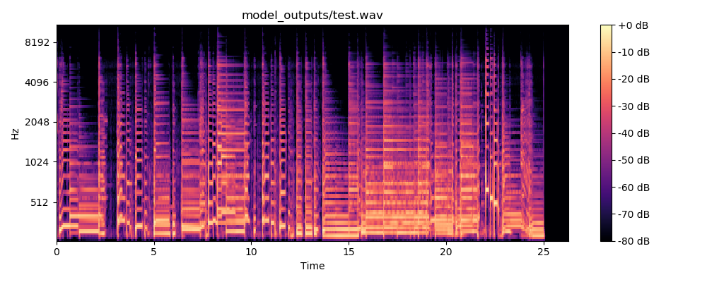

# Introduction

## Musical Effects

Musical effects are transformations which can be applied to an audio track to change the sound in some way. These can take the form of simple tweaks to the frequency range of the track to applying pitch modulation and beyond. 

Musical effects can completely change the way a track sounds and the art of mixing a track is - in many ways - more complicated than the composition and performance of the track. Sound engineers have a huge range of choices and responsibility when it comes to getting the soundscape correct for the final product.

The music industry is one of the few domains which is still to fully embrace digital technology. Many recording studios and musicians still make use of analogue equipment such as tape, vinyl, and vacuum tubes. As these technologies become more outdated and niche, the cost of maintaining and replacing equipment rises. As such, it is essential that software modelling catches up to the performance and quality of these older technologies.

## Musical Effect Modelling

The main standard for producing digital effects for use with audio is through the Virtual Studio Technology (VST) protocol. This protocol defines a standardised definition for how a VST host would behave, allowing VST Plugins to be created which manipulate or use the audio track in some way.

The technology itself is fairly flexible and allows everything from audio visualisation tools to CPU intensive transformations to be applied. These effects can also be stacked and ordered easily and intuitively.

Most effects however, are limited to digital signal processing (DSP) based transformations, the likes of which are unable to replicate the non-linearity of many analogue methods. This is cause for concern in the music industry and is the reason many professionals and hobbyists claim that they are inadequate for anything more than practice and experimentation.

## Machine Learning

In recent years, a huge amount of research has gone into machine learning. Its application frequently makes news for revolutionising the various industries it is applied to. As such, it would be interesting to see the effectiveness of machine learning in this field. 

Of particular interest to us were convolutional neural networks and Long-Short Term Memory (LSTM) networks, which both seem to be at the forefront of deep learning research. However, the application of machine learning to audio data is in its infancy, resulting in quite a challenging implementation with many layers to it and several dependencies.

The idea of the project is to create two audio tracks, one which is a clean signal from an instrument and one which is the result of applying a VST effect to that clean track. We would then create a neural network which would take samples from the clean signal and be trained to produce the value of the corresponding sample in the processed track.

# Background

## Nebula VST

Nebula yields the best results current modelling technologies can achieve. It achieves this using Volterra Kernel Modelling to better represent non-linear behaviours and exhibiting some level of memory capacity. This allows it to model time-based effects and non-linearity more effectively than primitive DSP approaches.

In doing this, it has become one of the most praised pieces of modelling software, criticised only for its system requirements and its steep learning curve. Requiring a minimum of 8GB of RAM with a recommended amount of 16-128GB, it is a rather demanding piece of software. 

Given that Nebula is the best plugin available at this time, for this project to be considered a success, it should be as good as or better than Nebula.
    
## Project Magenta

Project Magenta is a venture by the Google Brain Team, their goal is to explore the use of machine learning in creating art, with a particular interest in music. Most of their research is in audio synthesis with some ventures into genre classification and similar problems.

However, this project does raise some interesting questions about the ability of deep learning to characterise the complexities of music.

Most of their work however, was limited to interacting with MIDI data rather than with raw audio samples, perhaps limiting the complexity of the problem, making it an unfair comparison in terms of complexity to effect modelling.

## WaveNet

Another use of deep learning for audio synthesis is in the field of generating realistic text-to-speech. DeepMind's WaveNet is a generative network, trained using raw audio samples to predict the value of the next sample in the series. 

The project found that while generally an LSTM is better suited to this kind of time-series problem, they could achieve similar results using stacked convolutional layers applying dilated casual convolutions. At each layer they would double the dilation amount up to a maximum before starting again at 1. This a increases the receptive field of the network in a similar way to how an LSTM selectively remembers traits while maintaining the ease of training of a convolutional network.

Another way in which the WaveNet implementation differs from a standard convolutional network is in its output layer. Instead of predicting a sample as a floating point value representing the amplitude, the output is a one-hot encoded vector where the largest index corresponds with the $\mu$--Law encoded integer of the sample.

\begin{center}

    $F(x) = sgn(x)\frac{ln(1+\mu|x|)}{ln(1+\mu)} -1 <= x <= 1$

    $\mu$ Law as expressed in \LARGE{SOURCE THIS}
\end{center}

This network has proven itself to be capable of generating extremely effective, almost human sounding text-to-speech and is far easier to train than a standard LSTM-based approach.

# Aims

## Effect Choices

The aim of this project is to explore the viability and success of deep learning in effect modelling at a fairly general level. As such, a multitude of different effects should be tested. 

While there is a huge range of commonly used effects, and an even larger range of different variations of these same effects with subtly different responses, most of them fit in to one of three groups.

\begin{center}
\begin{tabular}{ |c|c|c| } 
 \hline
    \textbf{Amplitude Based} & \textbf{Frequency Based} & \textbf{Time Based} \\ 
 \hline
 Distortion & High/Low Pass Filter & Chorus \\ 
 Fuzz & Pitch Shift/Octave & Delay \\ 
 Compression & & Reverb \\ 
 Amplifier/Cab Simulation & & \\ 
 \hline
\end{tabular}
\end{center}

Narrowing the scope of the project to include only these effects results in a good indication of viability across a multitude of effects, while keeping the project scope at an attainable level.

## Deep Learning 

Deep learning has demonstrated extreme potential in the realm of text-to-speech and audio generation. As such, it is possible that it would prove similarly effective in effect modelling.

A few different types of deep learning were of particular interest. With regards to amplitude based effects, most of the transformation is carried out across a narrow time-frame, and non-linearity is limited. As such, for these effects it was hypothesised that a simple Convolutional Net with a window of narrow window of samples as the input would be sufficient. The same was thought for the frequency based effects such as filters.

For Time Based effects however, the active window of the effect can be much larger, with reverb sometimes being used with multiple second long tail. Given that music is generally sampled at 44,100Hz, this means that for the network to model this, it would require more than 44,100 samples as its input vector. This is obviously impractical as the memory requirements and time to train the network would be impractical.

In order to try and work around this, LSTM networks would be explored as a potential remedy. These would be able to learn which aspects of the track need to be remembered to best replicate the effect.

# Methods

## Network Architecture

### Convolutional Networks

Apart from WaveNet, guidance for creating a network architecture suitable for capturing the complexities of audio data were hard to come by. Most of the experience I had with machine learning was limited to completing example problems and tutorials. 

As such, the first goal was to adapt one of these example networks to receive audio data rather than text or image data which the tutorial used. The network I chose to adapt was one which performed well on the MNIST image classification dataset.

This network consisted of 2 Convolutional Layers with Rectified Linear Unit (ReLU) activation layers between, the results of which were then forwarded into a Max Pooling layer before a series of fully connected layers. A simplified diagram of this is shown in Figure {@fig:nn}

{#fig:nn height=6in}

### Long-Short Term Networks

It was thought that while a convolutional network would be impractical in learning the spatial elements required to reproduce a time-based effect such as reverb or chorus. Some kind of recursive neural network (RNN) was hypothesised to be able to replicate this behaviour as it would take the samples from the track in one at a time and learn what properties to remember and for how long. 

The downside to this was that training time is much slower as the network has a great deal more properties to learn than a typical feed-forward network.

### WaveNet 

Another idea was to implement the same basic network as WaveNet. Using dilated casual convolutions to classify the predicted value based on a one-hot encoded vector. This worked extremely well for generating speech data, exhibiting a "subjective naturalness never before seen."

## Evaluating Success

### Melspectograms

Spectograms are a graphical representation of an audio signal. They show detailed information about the frequencies present in a signal over time. The resulting representation is often used in speech recognition problems as a means of feature extraction. Allowing the system to identify the words spoken.  As such, they can be used as a quantitative means of evaluating how closely the network output matches the VST output.

The process for creating Melspectograms is based on mapping the signal to Mel Scale using the Fourier Transform. This can then be represented as a heatmap of frequencies in Hz which are present in the audio. Figure @fig:spectogram
shows an example of this on an audio track.

This is a vital tool in determining how effectively frequency based effects are being modelled as it shows any changes to the EQ of the track.

### Impulse Response

Impulse responses are used to represent distinct audible events. They can be visualised by simple graphing the amplitudes over time of a sample. This generates a line showing the intensity of the signal over a given time period.

Impulse responses can be useful in identifying the perceived volume or gain applied to a signal, making it a vital tool in determining how well the network is modelling distortion and other amplitude based effects.

Figure @fig:impulse shows an example of an impulse response graph.

### ABX Testing

ABX testing takes the form of having 3 tracks, A which is our clean signal, B which is our processed effect, and X which is the output of the network. The listener is not informed which track is which and has to say whether X sounds more like A or B. 

For our project to be considered successful, the results would show extreme bias in X sounding more like B than A. As this means that the network is producing tracks which sound more like the processed effect than the clean input.

{#fig:spectogram width=6in height=2.4in}

{#fig:impulse width=6in height=4.5in}

# Implementation

## Generating Test Data

In any deep learning scenario, one of the most important factors in success is in having a large and varied dataset for training. As such, for this project, it was decided that we would generate random audio data as needed, giving a theoretically infinite amount of training data. 

While random data ensures a significantly large dataset, the number of parameters which could be randomised was limited. In case this resulted in overfitting, it was also decided to supplement the randomised data with real music. 

### Random Audio Signals

The random audio data was generated using the `scipy.signal` module. The function `chirp` was used to generate an audio signal which rises or falls in pitch from one frequency to another. The frequencies are both randomised from the range of 80Hz to 1200Hz as this is roughly the frequency range of an electric guitar. The speed at which this frequency sweep occurs is also randomised. Frequency sweeping was thought to imitate a guitar string being bent or slid from one note to another.

Numpy was also used to generate sine waves at fixed frequencies from the above range. This would simulate a single sustained note from a guitar or other instrument.

To further add variety, scipy's `square` and `sawtooth` functions were used with random frequencies to further add to the variety of different sounds that can appear in the resulting audio tracks. 

Beyond this, the generated data is split into 'segments' which was done to replicate the way that music can vary in terms of speed, intensity and general level of complexity. Each segment is 10 seconds long. 

This means that every 10 seconds of audio data generated varies in terms of how many different notes or waveforms are being expressed at a given time, and how big the gaps between notes are. This was introduced to replicate the fact that there is rarely just a signal note playing in a musical piece. This could be important for modelling the time-based effects as it adds a greater variety to the audio which may need to be remembered to successfully model chorus, delay and reverb.

Generating the audio was carried out in a Python script called `generate.py` which two integer arguments, the first determines how many audio tracks are to be generated and the second determines the number of segments per track.

### Applying VSTs to Tracks

To train the network, we need a clean signal which takes the form of the output from `generate.py`, we then also need files which represent that track after it has been processed by an effect. 

In order to achieve this, a VST host which could be invoked through the command line was preferred. Initially a command line utility known as MrsWatson was selected for this. It could be invoked with a command such as `mrswatson --input mysong.wav --output out.wav --plugin myplugin` to apply an effect called `myplugin` to `mysong.wav`.

However, MrsWatson proved to behave inconsistently. Using it with Linux required the plugins to have been specifically compiled for Linux and since there are so few audio professionals working on this platform the number of effects available were seriously limited. Beyond this, the quality of the output was poor, often exhibiting hiss or other signal noise being introduced. 

As such, a new solution was required. This came in the form of Reaper. A fully-featured Digital Audio Workstation. While Reaper has a huge range of features, the feature of interest in this project is its batch mode which can be invoked with the command line. This mode allows a list of files to be given in a line-delimited file and a Reaper signal chain file to be given to be applied to each of these files.

A `bash` script was created to automatically generate the files using `generate.py`, the dataset would be saved in a folder called 'dataset' The script would then run Reapers batch mode on the files putting the resulting files in 'dataset/processed' with the same file name as their corresponding source files.

### Supplementing Dataset with Real Music

The script was later adapted to incorporate any audio files placed in the 'training_audio' folder into this process. Allowing users to easily supplement the random training data with real music. This could potentially solve issues with overfitting and make it easier for the network to learn more subtle effect features.

## Deep Learning Framework

After considering the various options for machine learning in Python, the framework of choice was PyTorch. PyTorch facilitates a tight integration between the Python code which defines the network architecture and the C/C++ code which runs the neural network defined in the Python code. Using a framework like Caffe or TensorFlow, the state of the network is hidden from the Python runtime as it exists as a separate process. PyTorch works around this with only a small impact on speed and memory efficiency. 

This allows for easy debugging as the Python debugger and simple `print` statements can be used to verify the behaviour of the network at a given time. This alleviates the learning curve of having to use something like TensorBoard for TensorFlow to visualise the network state.

Beyond this, PyTorch has a very 'Python-first' philosophy, allowing Tensors to be manipulated using standard Python list slicing, it's even possible to perform list comprehensions on them.

PyTorch has three main modules which were used in this project:

* The base module `torch`, which provides access to the `torch.Tensor` and its various subclasses.
* `torch.nn` which provides the necessary implementations of neural network layers. 
    - Also provides `nn.Sequential`, which can be used to stack various layers into one class for ease of use and to eliminate the boilerplate code which often is required of other frameworks. 
* `torch.Autograd` which provides the `Variable` class, this encapsulates a `Tensor` and allows it to be used with backward propagation for Deep Learning to be carried out.

## Visualisation

### Melspectogram

This was achieved using MatPlotLib and LibRosa. LibRosa has a range of functions for visualising audio data, including the function `melspectogram` found withing the `librosa.feature` module. This generates a Numpy array.The `specshow` method in `librosa.display` acts as a wrapper for `mathplotlib.pyplot` and generates the spectogram when given the numpy array generated by `melspectogram`

### Signal Impulse Response

Impulse response graphs are relatively simple to implement from the data we get from `librosa.core.load` which is used to read in audio files. The result is an array of amplitudes over time which can simply be plotted in a line using `matplotlib.pyplot`. 

We can better compare the three audio files by plotting them the three of them on the same axis as is shown in @fig:axisshare

{#fig:axisshare}

## Audio I/O

The project utilises LibRosa for reading and writing `wav` files. This was chosen as it supports a multitude of different output formats. Early versions of the project were using `SciPy.IO.wavfile` for this but it was limited to 64 bit output files, which was unnecessarily large for audio data and required too much storage space. 

LibRosa will output the file with the smallest sample depth required to adequately represent the track, creating much smaller files. It is also much more robust and can even read `MP3`, for example if users want to include their own audio into the training data without having to convert it to `wav`.

# Results

- Split into quantitative and qualitative
- Signal Analysis (Quantitative)
- Spectogram GIFs (Quantitative)
- Loss over time / Standard Deviation of loss ( ??? - Loss hasn't really proven to be particularly meaningful)
- ABX tests with classmates/friends (Qualitative)

# Conclusion

# References
